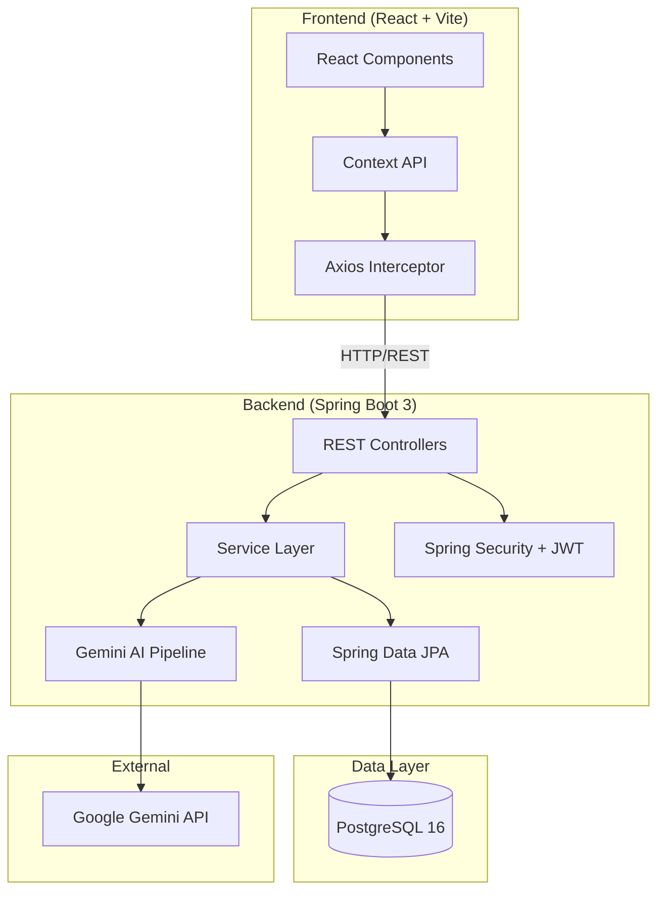
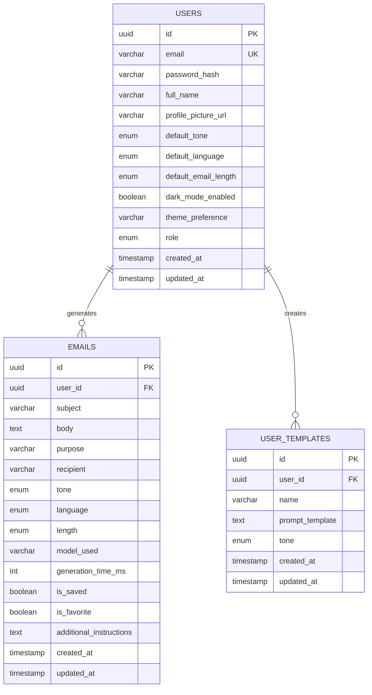

# 🤖 AI Email Generator

A production-grade, full-stack SaaS application that leverages **Google Gemini AI** to generate, refine, and manage professional emails. Built with **Spring Boot 3**, **React 18**, **PostgreSQL**, and containerized with **Docker**.

> 💡 **Developer Note:** While this is a full-stack application, the primary focus of this project was engineering a robust, scalable backend. Key achievements include designing a normalized PostgreSQL database, implementing stateless JWT security, integrating third-party AI APIs, and setting up centralized exception handling and rate limiting via Spring Boot.


[](https://openjdk.org/)
[](https://spring.io/projects/spring-boot)
[](https://react.dev/)
[](https://www.postgresql.org/)
[](https://docs.docker.com/compose/)

---

## ✨ Features

| Category | Features |
|----------|----------|
| 🤖 **AI Generation** | Generate professional emails with customizable tone, length, and language using Google Gemini |
| ✏️ **AI Actions** | Improve, shorten, expand, translate, fix grammar, or add bullet points to generated content |
| 📧 **Email History** | Save, search, filter, favorite, and paginate through your email archive |
| 📋 **Templates** | Browse a system prompt library (6 categories) or create your own reusable templates |
| 👤 **Profile** | Update personal info, change password with strength validation, configure preferences |
| ⚙️ **Settings** | Set default tone, language, email length, and theme preferences |
| 🔐 **Authentication** | JWT-based auth with registration, login, protected routes, and session persistence |
| 🌙 **Dark Mode** | Full dark mode support with system preference detection |
| 📱 **Responsive** | Mobile-first responsive design with collapsible sidebar |
| 📊 **Dashboard** | Analytics cards, recent activity timeline, AI preference summary, and quick actions |

---

## 🏗️ Architecture



---

## 🛠️ Technology Stack

| Layer | Technology |
|-------|-----------|
| **Frontend** | React 18, Vite, Tailwind CSS, React Router DOM, React Hook Form, Zod, Axios, Lucide Icons |
| **Backend** | Spring Boot 3.3, Spring Security, Spring Data JPA, MapStruct, Lombok, Bucket4j |
| **Database** | PostgreSQL 16 |
| **AI** | Google Gemini 1.5 Flash |
| **Auth** | JWT (JJWT 0.11.5), BCrypt |
| **API Docs** | SpringDoc OpenAPI (Swagger UI) |
| **Testing** | JUnit 5, Mockito, MockMvc, Vitest, React Testing Library |
| **DevOps** | Docker, Docker Compose, Nginx |
| **Deployment** | Render (backend), Vercel (frontend) |

---

## 📁 Folder Structure

```
ai-email-generator/
├── backend/
│   ├── src/main/java/com/aiemail/generator/
│   │   ├── ai/              # Gemini AI client, pipeline, prompt builders
│   │   ├── auth/            # Registration, login, user entity & repository
│   │   ├── common/          # Enums, constants, ApiResponse, validation
│   │   ├── config/          # CORS, OpenAPI, rate limiting configs
│   │   ├── dashboard/       # Analytics, statistics, recent activity
│   │   ├── email/           # Email generation, history, CRUD
│   │   ├── exception/       # Custom exceptions, global handler
│   │   ├── profile/         # User profile, settings, password
│   │   ├── security/        # JWT provider, filter, SecurityConfig
│   │   ├── template/        # User templates, prompt library
│   │   └── util/            # Date utilities
│   └── src/main/resources/
│       ├── application.yml
│       ├── application-dev.yml
│       ├── application-prod.yml
│       └── prompt-library.json
├── frontend/
│   └── src/
│       ├── components/       # UI library + feature components
│       ├── context/          # AuthContext, ThemeContext
│       ├── pages/            # All application pages
│       ├── routes/           # ProtectedRoute, PublicRoute, routeConfig
│       ├── services/         # Axios API clients
│       ├── test/             # Vitest test suites
│       └── utils/            # Helpers (date, clipboard, debounce, etc.)
├── docs/                     # Deployment guides, Postman collection
├── docker-compose.yml
├── .env.example
└── README.md
```

---

## 🗄️ Database Design



---

## 🚀 Getting Started

### Prerequisites

- **Java 21** (JDK)
- **Node.js 18+** & npm
- **Docker & Docker Compose**
- **Google Gemini API Key** ([Get one here](https://aistudio.google.com/apikey))

### Option 1: Docker Compose (Recommended)

```bash
# 1. Clone the repository
git clone https://github.com/your-username/ai-email-generator.git
cd ai-email-generator

# 2. Create your .env file
cp .env.example .env
# Edit .env and add your GEMINI_API_KEY

# 3. Start everything
docker compose up --build

# 4. Access the application
# Frontend:  http://localhost:3000
# Backend:   http://localhost:8080
# Swagger:   http://localhost:8080/swagger-ui.html
# Health:    http://localhost:8080/actuator/health
```

### Option 2: Local Development

```bash
# 1. Start PostgreSQL (Docker or local install)
docker run -d --name ai-email-db \
  -e POSTGRES_DB=ai_email_db \
  -e POSTGRES_USER=postgres \
  -e POSTGRES_PASSWORD=postgres \
  -p 5432:5432 postgres:16-alpine

# 2. Start the backend
cd backend
./mvnw spring-boot:run

# 3. Start the frontend
cd frontend
npm install
npm run dev
# Frontend runs at http://localhost:5173
```

---

## 📡 API Documentation

### Authentication
| Method | Endpoint | Description |
|--------|----------|-------------|
| `POST` | `/api/v1/auth/register` | Register a new user |
| `POST` | `/api/v1/auth/login` | Login and receive JWT |

### Email
| Method | Endpoint | Description |
|--------|----------|-------------|
| `POST` | `/api/v1/emails/generate` | Generate an AI email |
| `POST` | `/api/v1/emails/action` | Apply an AI action |
| `POST` | `/api/v1/emails` | Save an email |
| `GET` | `/api/v1/emails` | List email history |
| `GET` | `/api/v1/emails/{id}` | Get single email |
| `PATCH` | `/api/v1/emails/{id}/favorite` | Toggle favorite |
| `DELETE` | `/api/v1/emails/{id}` | Delete an email |

### Templates
| Method | Endpoint | Description |
|--------|----------|-------------|
| `GET` | `/api/v1/templates/library` | Get system prompt library |
| `GET` | `/api/v1/templates/library/categories` | List categories |
| `GET` | `/api/v1/templates/library/{id}` | Get library item |
| `POST` | `/api/v1/templates` | Create user template |
| `GET` | `/api/v1/templates` | List user templates |
| `GET` | `/api/v1/templates/{id}` | Get user template |
| `PUT` | `/api/v1/templates/{id}` | Update user template |
| `DELETE` | `/api/v1/templates/{id}` | Delete user template |

### Dashboard & Profile
| Method | Endpoint | Description |
|--------|----------|-------------|
| `GET` | `/api/v1/dashboard` | Dashboard summary |
| `GET` | `/api/v1/dashboard/activity` | Recent activities |
| `GET` | `/api/v1/dashboard/statistics` | Statistics cards |
| `GET` | `/api/v1/profile` | Get profile |
| `PUT` | `/api/v1/profile` | Update profile |
| `PUT` | `/api/v1/profile/password` | Change password |
| `PUT` | `/api/v1/profile/settings` | Update settings |

> 📖 **Full interactive API docs**: `http://localhost:8080/swagger-ui.html`

---

## 🚢 Deployment

| Component | Platform | Guide |
|-----------|----------|-------|
| Backend | Render | [docs/RENDER_DEPLOYMENT.md](docs/RENDER_DEPLOYMENT.md) |
| Frontend | Vercel | [docs/VERCEL_DEPLOYMENT.md](docs/VERCEL_DEPLOYMENT.md) |
| Full Stack | Docker | See "Docker Compose" above |

---

## 🧪 Testing

### Backend Tests
```bash
cd backend
./mvnw test
```

### Frontend Tests
```bash
cd frontend
npm run test
```

---

## ⚠️ Known Limitations

- **No real-time collaboration** — Single user per session
- **No file attachments** — Email body is text-only
- **No email sending** — Generates email content; does not send via SMTP
- **Avatar upload** — URL-based only; no file upload to cloud storage
- **Rate limiting** — In-memory only; resets on server restart

---

## 🔮 Future Enhancements

- [ ] OAuth2 (Google, GitHub) login
- [ ] Email scheduling and sending via SMTP
- [ ] Team workspaces and sharing
- [ ] Advanced analytics with charts
- [ ] Export to PDF/DOCX
- [ ] Real file upload for avatars (S3)
- [ ] Redis-backed rate limiting
- [ ] WebSocket notifications
- [ ] Multi-language UI (i18n)

---

## 📄 License

This project is licensed under the **MIT License**.

