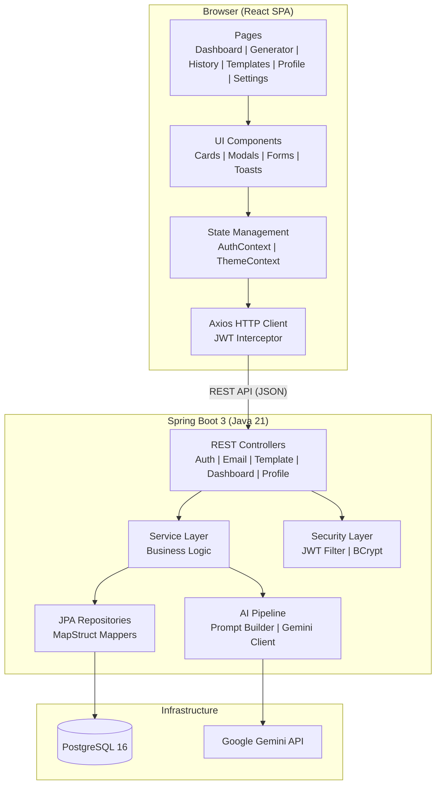
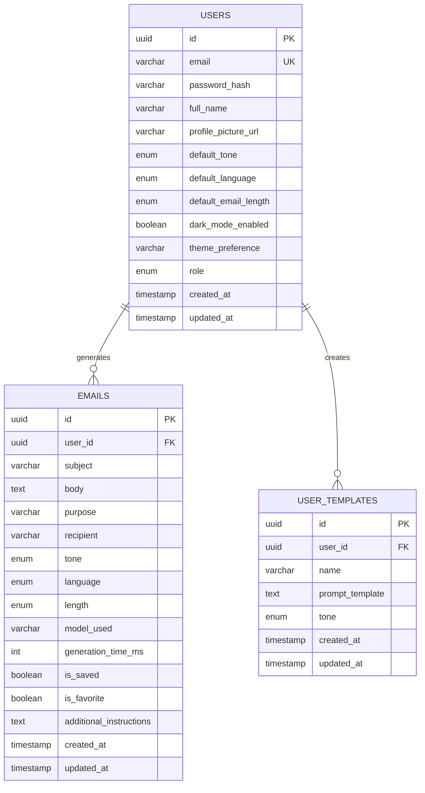
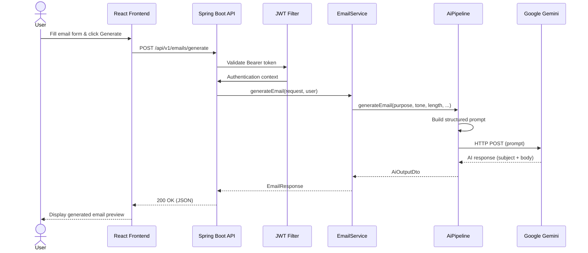
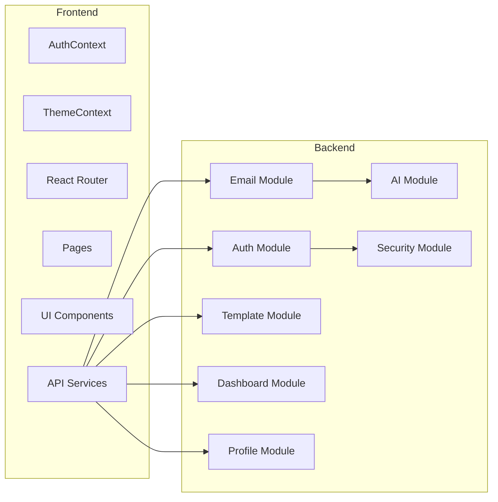
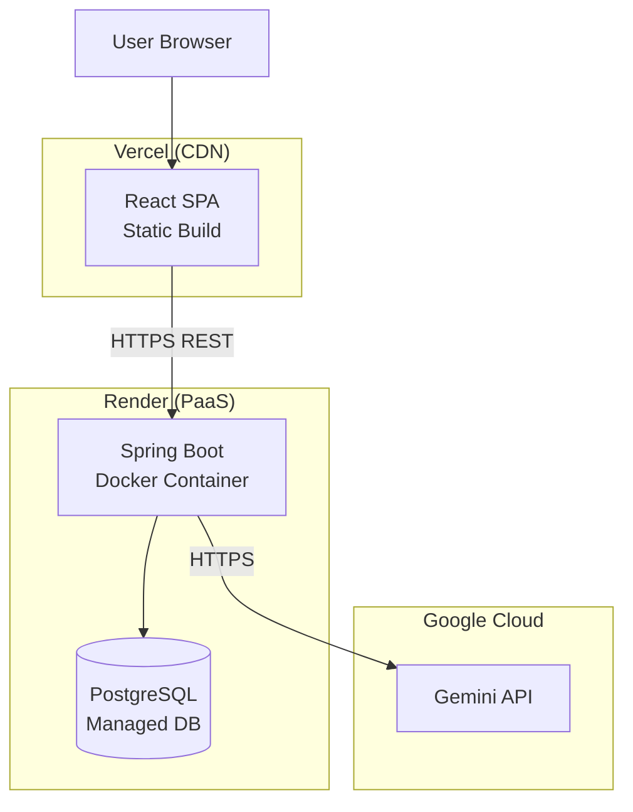

# 📂 Portfolio Assets — AI Email Generator

This document contains all portfolio-ready assets for interviews, resumes, and presentations.

---

## 🏛️ Architecture Diagram

---

## 🗄️ ER Diagram

---

## 🔄 Sequence Diagram — Email Generation Flow

---

## 📦 Component Diagram

---

## 🚀 Deployment Diagram

---

## 📝 Resume Project Description

> **AI Email Generator** — Full-stack SaaS application that generates professional emails using Google Gemini AI. Built with Spring Boot 3 (Java 21), React 18, PostgreSQL, and Docker. Features include JWT authentication, AI-powered email generation with customizable tone/length/language, AI refinement actions (improve, translate, shorten), email history with search/filter/pagination, a system prompt library, custom templates CRUD, user profile management, dark mode, and responsive design. Deployed via Docker Compose with Render (backend) and Vercel (frontend) deployment configurations.

---

## 📋 GitHub Repository Description

> 🤖 Full-stack AI Email Generator — Generate, refine, and manage professional emails with Google Gemini AI. Built with Spring Boot 3, React 18, PostgreSQL, JWT Auth, and Docker.

---

## 🎬 Demo Script (5–10 minutes)

### 1. Landing & Registration (1 min)
- Show the landing page design
- Register a new account
- Highlight the validation and password strength indicator

### 2. Dashboard Tour (1 min)
- Walk through statistics cards
- Show AI preferences panel
- Demonstrate recent activity timeline
- Click quick action links

### 3. Email Generation (3 min)
- Fill in the email form (purpose, recipient, tone, length)
- Click Generate and show the AI-powered output
- Apply an AI action: "Improve" → show the refined version
- Apply "Translate" to another language
- Save the email to history

### 4. Email History (1 min)
- Browse saved emails
- Use search to find a specific email
- Toggle favorite on an email
- Delete an email with confirmation dialog

### 5. Templates (1.5 min)
- Browse the Prompt Library categories
- Preview a system prompt
- Click "Use Template" → show auto-filled generator
- Switch to "My Templates" tab
- Create a new custom template
- Show duplicate name validation

### 6. Profile & Settings (1.5 min)
- Update profile name and avatar URL
- Change password with strength meter
- Update AI defaults (tone, language, length)
- Toggle dark mode and show instant theme switch

### 7. Technical Highlights (1 min)
- Show Swagger UI
- Show Docker Compose setup
- Mention the architecture (Spring Boot + React + Gemini)

---

## 💬 Interview Talking Points

### Architecture Decisions
- **Modular monolith** — Clean package separation by feature (auth, email, template, dashboard, profile, ai)
- **Interface-driven services** — Every service has an interface for testability
- **MapStruct mappers** — Zero-reflection DTO conversion at compile time
- **Isolated AI module** — Gemini integration is completely decoupled from business logic

### Security
- **JWT with HMAC-SHA512** — Stateless authentication
- **BCrypt password hashing** — Industry-standard password storage
- **CORS configuration** — Whitelist-based origin control
- **Rate limiting** — Bucket4j-based request throttling

### Frontend Patterns
- **Context API over Redux** — Simpler state management for auth and theme
- **React Hook Form + Zod** — Type-safe form validation
- **Axios interceptors** — Automatic JWT injection and 401 handling
- **Protected/Public routes** — Route-level access control

---

## ❓ Common Interview Q&A

**Q: Why did you choose Spring Boot over Node.js?**
> Spring Boot provides enterprise-grade dependency injection, JPA for database abstraction, and robust security via Spring Security. Java 21's virtual threads and strong typing also improve reliability and maintainability.

**Q: Why Google Gemini instead of OpenAI?**
> Gemini offers competitive quality with a generous free tier, making it ideal for portfolio projects. The AI module is interface-driven, so swapping to another provider requires only a new client implementation.

**Q: How do you handle authentication?**
> Stateless JWT authentication. Tokens are signed with HMAC-SHA512, stored client-side in localStorage, and validated on every request via a custom Spring Security filter chain. Passwords are hashed with BCrypt.

**Q: How is the AI module designed?**
> It follows a pipeline pattern: EmailService → AiPipeline → PromptBuilder → GeminiClient. Prompt builders are strategy-based (generation vs. action), keeping the Gemini client completely unaware of business logic.

**Q: How do you test without hitting the real Gemini API?**
> All tests mock the AiPipeline interface. The GeminiClient is never instantiated in tests. Backend tests use Mockito + H2 in-memory DB.

**Q: What would you change for production scale?**
> Add Redis for rate limiting and session caching, implement OAuth2, use message queues for async AI processing, add comprehensive logging with ELK stack, and implement CI/CD pipelines.

---

## 🎯 Design Decisions

| Decision | Rationale |
|----------|-----------|
| Modular monolith | Faster development; clean boundaries allow future microservice extraction |
| JWT over sessions | Stateless; scales horizontally without sticky sessions |
| MapStruct over manual mapping | Compile-time safety; zero runtime reflection overhead |
| Context API over Redux | Sufficient for 2-context app; avoids boilerplate |
| Tailwind CSS | Rapid prototyping; consistent design tokens; purges unused CSS |
| H2 test database | Tests run without Docker; fast CI pipeline |

---

## 🧗 Challenges Faced

1. **Gemini API response parsing** — JSON responses needed careful schema extraction; solved with structured prompt engineering
2. **JWT + CORS coordination** — Custom security filter chain ordering was critical; `SecurityConfig` required precise `permitAll()` paths for Swagger and auth endpoints
3. **MapStruct + Lombok compatibility** — Required specific annotation processor ordering in Maven
4. **Dark mode persistence** — Syncing ThemeContext (client) with ProfileSettings (server) required bidirectional updates

---

## 📸 Screenshot Checklist

For your GitHub README and Portfolio presentation, take high-quality screenshots (or GIFs) of the following states:

1. **[ ] Landing / Login Page**: Show the clean auth design and SaaS styling.
2. **[ ] Registration Validation**: Show the `PasswordStrengthMeter` reacting to input.
3. **[ ] Dashboard Overview**: Capture the statistics cards and recent activity timeline.
4. **[ ] Email Generator Form**: The `/generate` route with the form filled out (before generating).
5. **[ ] AI Result Preview**: The generated email inside the rich text display area.
6. **[ ] AI Action Dropdown**: Show the "Refine" menu open (Improve, Translate, Shorten).
7. **[ ] Email History**: The paginated history list, showing the search bar and filter badges.
8. **[ ] System Prompt Library**: The `TemplatesPage` showing the categorized built-in prompts.
9. **[ ] Custom Template Modal**: The "Create Template" modal open with validation active.
10. **[ ] User Profile**: The Avatar Uploader and settings form.
11. **[ ] Settings / Theme**: The preference selectors. Take one screenshot in **Light Mode** and another in **Dark Mode** to demonstrate the theme toggle.
12. **[ ] Mobile View**: Shrink the browser to mobile width and capture the dashboard with the hamburger menu open.

---

## 🔮 Future Improvements

- OAuth2 social login (Google, GitHub)
- Real-time collaboration with WebSockets
- Advanced analytics dashboard with Chart.js
- CI/CD pipeline (GitHub Actions)
- Email scheduling and SMTP sending
- Multi-tenant workspaces
- i18n/l10n for UI translations
